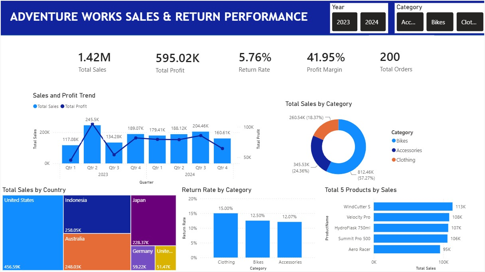

# 📊 Adventure Works Sales & Return Performance Dashboard

## 📌 Project Overview

This project presents an interactive **Power BI dashboard** built using the Adventure Works dataset. The dashboard provides a comprehensive analysis of sales performance, profitability, product categories, and return rates to support data-driven business decision-making.

---

## 🎯 Business Objective

The goal of this dashboard is to help stakeholders monitor business performance and answer key business questions regarding sales, profitability, customer behavior, and product returns.

---

## 🛠️ Tools & Technologies

- Power BI
- DAX
- Power Query
- Data Modeling
- Data Visualization

---

## ❓ Business Questions

This dashboard aims to answer the following questions:

- How do sales and profit trend over time?
- Which products generate the highest sales?
- Which countries contribute the most revenue?
- Which product categories contribute the most sales?
- Which categories have the highest return rates?

---

## 📊 Dashboard Features

- Executive KPI Cards
- Sales & Profit Trend Analysis
- Sales by Country
- Sales by Product Category
- Return Rate Analysis
- Top 5 Best-Selling Products
- Interactive Filters (Year & Category)

---

## 💡 Key Insights

- 🚲 **Bikes** generated the highest revenue, contributing **57.27%** of total sales.
- 🇺🇸 **United States** recorded the highest sales among all countries.
- 👕 **Clothing** experienced the highest return rate at **15%**, indicating potential quality or customer satisfaction issues.
- 📈 Sales reached their highest point during **Q2 2023**, followed by a slight decline before stabilizing throughout 2024.
- 💰 Despite fluctuations in sales, overall profitability remained relatively stable across the analysis period.

---

## 📈 Business Recommendations

Based on the analysis:

- Focus marketing and promotional campaigns on the **Bikes** category to maximize revenue.
- Investigate the root causes of the high return rate in the **Clothing** category.
- Continue strengthening sales strategies in the **United States**, the company's strongest market.
- Review lower-performing product categories to identify opportunities for growth.
- Monitor quarterly sales trends to improve inventory planning and demand forecasting.

---

## 👨‍💻 Author

**Aqila Musyaffa**
